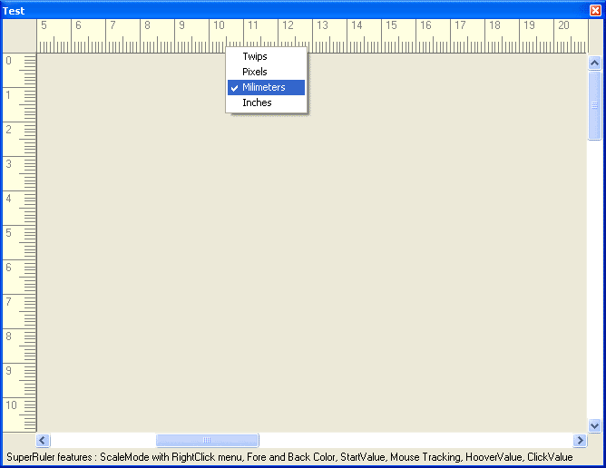



## SuperRuler 1\.0

### Description

Advanced Controls - SuperRuler 1.0 

OnScreen measurement control.

Select between four ScaleModes, change Fore and Back Color, use hoover or click values.

Includes mouse tracking.
 
### More Info
 

             |
---                |---
**Submitted On**   |2002-08-26 11:46:06
**By**             |[ORSHEE](https://github.com/Planet-Source-Code/PSCIndex/blob/master/ByAuthor/orshee.md)
**Level**          |Advanced
**User Rating**    |4.9 (49 globes from 10 users)
**Compatibility**  |VB 6\.0
**Category**       |[Custom Controls/ Forms/  Menus](https://github.com/Planet-Source-Code/PSCIndex/blob/master/ByCategory/custom-controls-forms-menus__1-4.md)
**World**          |[Visual Basic](https://github.com/Planet-Source-Code/PSCIndex/blob/master/ByWorld/visual-basic.md)
**Archive File**   |[SuperRuler12257582620\.zip](https://github.com/Planet-Source-Code/orshee-superruler-1-0__1-38309/archive/master.zip)

